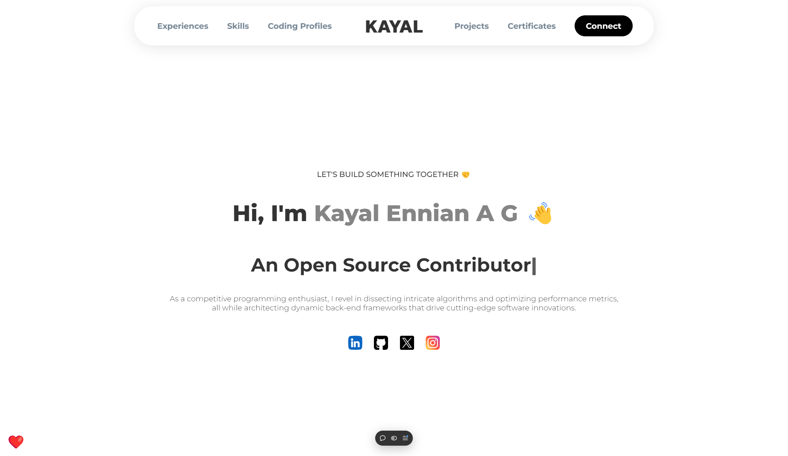

# 💻 Welcome to **[Your Project Name]**! 🎉

<p align="center">
  

</p>


<p align="center">
  <b>Transforming ideas into reality with ⚡ speed and 🧠 intelligence!</b>
</p>

---

## 🚀 **About the Project**

Welcome to **[Your Project Name]** – a project that aims to revolutionize [the field you're working in]! 🌟

### 🛠 **Technologies Used:**
- **Frontend**: Vue.js, HTML5, CSS3 🎨
- **Backend**: Node.js, Express.js 🛠️
- **Database**: MongoDB 🍃
- **Deployment**: Vercel ✨    
- **Version Control**: Git & GitHub 🗃️

This project is designed to [briefly describe the project and its purpose]. Whether you're a **developer** 🧑‍💻, **designer** 🎨, or just curious 👀, feel free to explore, contribute, or just give it a ⭐️!

---

## 🎯 **Features**
- 🚀 **Fast & Responsive** – Built with performance and speed in mind.
- 💡 **Innovative Design** – Clean and intuitive UI/UX.
- 🔒 **Secure** – Follows industry best practices for security.
- 🔄 **Scalable** – Ready to handle growing user demands.
- 🤖 **AI-powered** – Utilizes cutting-edge ML/AI technologies.

---

## 🛠️ **Installation Instructions**

1. **Clone the Repository**:
   ```bash
   git clone https://github.com/yourusername/yourproject.git
   ```

2. **Install Dependencies**:
   ```bash
   cd yourproject
   npm install
   ```

3. **Run the Project**:
   ```bash
   npm run serve
   ```

---

## 🧩 **Contributing**

We welcome all kinds of contributions! 🎉 Whether it's a bug fix 🐛, feature suggestion 💡, or code refactor 🧑‍💻, you can help make this project better! To contribute:

1. Fork the repository 🍴
2. Create a new feature branch 📂 (`git checkout -b feature/amazing-feature`)
3. Commit your changes 💾 (`git commit -m 'Add some amazing feature'`)
4. Push to the branch 🚀 (`git push origin feature/amazing-feature`)
5. Open a Pull Request 👋

---

## 🌟 **Support & Contact**

If you have any questions or need support, feel free to open an issue or contact me directly!

- **LinkedIn**: [Kayal Ennian A G](https://linkedin.com/in/kayalennian) 💼
- **Twitter**: [@kayalennian](https://twitter.com/kayalennian) 🐦
- **GitHub**: [@iamendless10](https://github.com/iamendless10) 🔥

---

## 📜 **License**

This project is licensed under the MIT License. 📝 Feel free to use, modify, and distribute as needed!

---

## 📣 **Acknowledgements**

Big thanks to everyone contributing to the project and making it better! 💖 Your support, contributions, and feedback mean a lot!

---

<p align="center">
  <b>Made with ❤️ by Kayal Ennian A G</b>
</p>

---